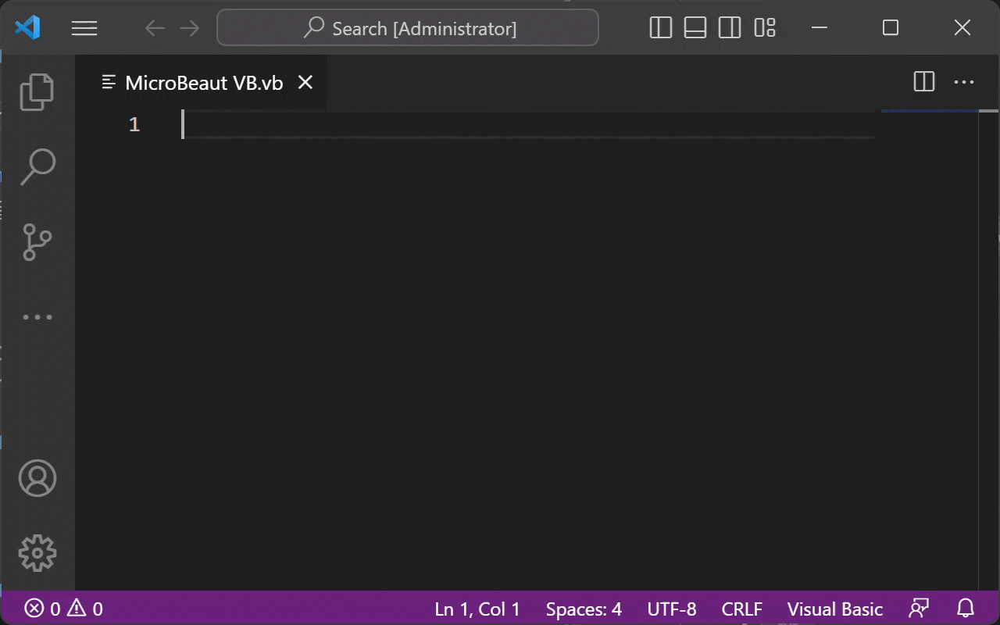

# MicroBeaut VBA Snippets
### Visual Basic for Applications (VBA) Snippets
<br/>


# Language Support
### Visual Basic
 <br/>


# Statements
## **``ChDir``**
Changes the current directory or folder.


### **Prefix**
```vb
ChDir
```

### **Syntax**
```vb
ChDir path
```

<br/>


## **``ChDrive``**
Changes the current drive.

### **Prefix**
```vb
ChDrive
```

### **Syntax**
```vb
ChDrive drive
```

<br/>


## **``Const``**
Declares <span style="color:blue">constants</span> for use in place of literal values.

### **Prefix**
```vb
Const
```

### **Syntax**
```vb
[ Public | Private ] Const constname [ As type ] = expression
```


<br/>


## **``DeleteSetting ``**
Deletes a section or key setting from an application's entry in the Windows <span style="color:blue">registry</span> or (on the Macintosh) information in the application's initialization file.

### **Prefix**
```vb
DeleteSetting
```

### **Syntax**
```vb
DeleteSetting appname, section, key
```
<br/>


## **``Dim``**
Declares <span style="color:blue">variables</span> and allocates storage space.

### **Prefix**
```vb
Dim
Dim WithEvents
```

### **Syntax**
```vb
Dim [ WithEvents ] varname [ ( [ subscripts ] ) ] [ As [ New ] type ]
```
<br/>


## **``Do...Loop``**
Repeats a block of <span style="color:blue">statements</span> while a condition is **True** or until a condition becomes **True**.

### **Prefix**
```vb
Do Until Loop

Or,

Do While Loop
```

### **Syntax**
```vb
Do [{ While | Until } condition ]
  [ statements ]
  [ Exit Do ]
  [ statements ]
Loop
```

Or,

### **Prefix**
```vb
Do Loop Until

or,

Do Loop While
```

### **Syntax**
```vb
Do
  [ statements ]
  [ Exit Do ]
  [ statements ]
Loop [{ While | Until } condition ]
```
<br/>


## **``Enum``**
Declares a type for an enumeration.

### **Prefix**
```vb
Enum
```

### **Syntax**
```vb
[ Public | Private ] Enum name
  membername [= constantexpression ]
  membername [= constantexpression ] . . .
End Enum
```
<br/>


## **``Erase``**
Reinitializes the elements of fixed-size <span style="color:blue">arrays</span> and releases dynamic-array storage space.

### **Prefix**
```vb
Erase
```

### **Syntax**
```vb
Erase arraylist
```
<br/>


## **``For Each...Next``**
Repeats a group of <span style="color:blue">statements</span> for each element in an <span style="color:blue">arrays</span> or collection.

### **Prefix**
```vb
For Each
```

### **Syntax**
```vb
For Each element In group
  [ statements ]
  [ Exit For ]
  [ statements ]
Next [ element ]
```
<br/>


## **``For...Next``**
Repeats a group of <span style="color:blue">statements</span> a specified number of times.

### **Prefix**
```vb
For

Or,

For Next
```

### **Syntax**
```vb
For counter = start To end [ Step step ]
  [ statements ]
  [ Exit For ]
  [ statements ]
Next [ counter ]
```
<br/>

## **``Function``**
Declares the name, arguments, and code that form the body of a **Function** <span style="color:blue">procedure</span>.

### **Prefix**
```vb
Function

Or,

Function Static
```

### **Syntax**
```vb
[Public | Private | Friend] [ Static ] Function name [ ( arglist ) ] [ As type ]
  [ statements ]
  [ name = expression ]
  [ Exit Function ]
  [ statements ]
  [ name = expression ]
End Function
```
<br/>

## **``If...Then...Else``**
Conditionally executes a group of <span style="color:blue">statements</span>, depending on the value of an expression.

### **Prefix**
```vb
If
```

### **Syntax**
```vb
If condition Then [ statements ] [ Else elsestatements ]

Or,

If condition Then
  [ statements ]
[ ElseIf condition-n Then
  [ elseifstatements ]]
[ Else
  [ elsestatements ]]
End If
```
<br/>


## **``Load``**
Loads an object but doesn't show it.

### **Prefix**
```vb
Load
```

### **Syntax**
```vb
Load object
```
<br/>


## **``LSet``**
Left aligns a string within a string variable, or copies a variable of one <span style="color:blue">user-defined type</span> to another variable of a different user-defined type.

### **Prefix**
```vb
LSet
```

### **Syntax**
```vb
LSet stringvar = string
LSet varname1 = varname2
```
<br/>


## **``Mid``**
Replaces a specified number of characters in a **Variant (String)** variable with characters from another string.

### **Prefix**
```vb
Mid
```

### **Syntax**
```vb
Mid(stringvar, start, [ length ] ) = string
```
<br/>


## **``On Error``**
Enables an error-handling routine and specifies the location of the routine within a procedure; can also be used to disable an error-handling routine.

### **Prefix**
```vb
On Error GoTo
On Error Resume Next
```

### **Syntax**
```vb
On Error GoTo 0
On Error GoTo line
On Error Resume Next
```
<br/>

## **``Option Base``**
Used at the module level to declare the default lower bound for array subscripts.

### **Prefix**
```vb
Option Base
```

### **Syntax**
```vb
Option Base { 0 | 1 }
```
<br/>


## **``Option Compare``**
Used at the module level to declare the default comparison method to use when string data is compared.

### **Prefix**
```vb
Option Compare
```

### **Syntax**
```vb
Option Compare { Binary | Text | Database }
```
<br/>


## **``Option Explicit``**
Used at the module level to force explicit declaration of all variables in that module.

### **Prefix**
```vb
Option Explicit
```

### **Syntax**
```vb
Option Explicit
```
<br/>

## **``Option Private Module``**
When used in host applications that allow references across multiple projects, **Option Private Module** prevents a module's contents from being referenced outside its project. In host applications that don't permit such references, for example, standalone versions of Visual Basic, **Option Private** has no effect.

### **Prefix**
```vb
Option Private Module
```

### **Syntax**
```vb
Option Private Module
```
<br/>


## **``Private``**
Used at the module level to declare private variables and allocate storage space.

### **Prefix**
```vb
Private

Or,

Private WithEvents
```

### **Syntax**
```vb
Private [ WithEvents ] varname [ ( [ subscripts ] ) ] [ As [ New ] type ]
```
<br/>


## **``Property Get``**
Declares the name, arguments, and code that form the body of a **Property** procedure, which gets the value of a property.

### **Prefix**
```vb
Property Get
Property Get Static
```

### **Syntax**
```vb
[ Public | Private | Friend ] [ Static ] Property Get name [ (arglist) ] [ As type ]
  [ statements ]
  [ name = expression ]
[ Exit Property ]
  [ statements ]
  [ name = expression ]
End Property
```
<br/>


## **``Property Let``**
Declares the name, arguments, and code that form the body of a **Property** procedure, which assigns a value to a property.

### **Prefix**
```vb
Property Let
Property Let Static
```

### **Syntax**
```vb
[ Public | Private | Friend ] [ Static ] Property Let name ( [ arglist ], value )
  [ statements ]
  [ Exit Property ]
  [ statements ]
End Property
```
<br/>

## **``Property Set``**
Declares the name, arguments, and code that form the body of a **Property** procedure, which sets a reference to an object.

### **Prefix**
```vb
Property Set
Property Set Static
```

### **Syntax**
```vb
[ Public | Private | Friend ] [ Static ] Property Set name ( [ arglist ], reference )
  [ statements ]
  [ Exit Property ]
  [ statements ]
End Property
```
<br/>


## **``Public``**
Used at the module level to declare public variables and allocate storage space.

### **Prefix**
```vb
Public

Or,

Public WithEvents
```

### **Syntax**
```vb
Public [ WithEvents ] varname [ ( [ subscripts ] ) ] [ As [ New ] type ]
```
<br/>


## **``ReDim``**
Used at the procedure level to reallocate storage space for dynamic array variables.

### **Prefix**
```vb
ReDim
```

### **Syntax**
```vb
ReDim [ Preserve ] varname ( subscripts )
```
<br/>


## **``RmDir``**
Removes an existing directory or folder.

### **Prefix**
```vb
RmDir
```

### **Syntax**
```vb
RmDir path
```
<br/>

## **``RSet``**
Right aligns a string within a string variable, or copies a variable of one user-defined type to another variable of a different user-defined type.

### **Prefix**
```vb
RSet
```

### **Syntax**
```vb
RSet stringvar = string
RSet varname1 = varname2
```
<br/>


## **``SaveSetting``**
Saves or creates an application entry in the application's entry in the Windows registry or (on the Macintosh) information in the application's initialization file.

### **Prefix**
```vb
SaveSetting
```

### **Syntax**
```vb
SaveSetting appname, section, key, setting
```

### **Remarks**
The root of these registry settings is: <code>Computer\HKEY_CURRENT_USER\Software\VB and VBA Program Settings</code>.
<br/>


## **``Select Case``**
Executes one of several groups of statements, depending on the value of an expression.

### **Prefix**
```vb
Select Case
```

### **Syntax**
```vb
Select Case testexpression
[ Case expressionlist-n
  [ statements-n ]]
[ Case Else 
  [ elsestatements ]]
End Select
```
<br/>

## **``Static``**
Used at the procedure level to declare variables and allocate storage space. Variables declared with the **Static** statement retain their values as long as the code is running.

### **Prefix**
```vb
Static
```

### **Syntax**
```vb
Static varname [ ( [ subscripts ] ) ] [ As [ New ] type ]
```
<br/>


## **``Sub``**
Declares the name, arguments, and code that form the body of a **Sub** procedure.

### **Prefix**
```vb
Sub

Or,

Sub Static
```

### **Syntax**
```vb
[ Private | Public | Friend ] [ Static ] Sub name [ ( arglist ) ]
  [ statements ]
  [ Exit Sub ]
  [ statements ]
End Sub
```
<br/>

## **``Type``**
Used at the module level to define a user-defined data type containing one or more elements.

### **Prefix**
```vb
Type
```

### **Syntax**
```vb
[ Private | Public ] Type varname
  elementname [ ( [ subscripts ] ) ] As type
  [ elementname [ ( [ subscripts ] ) ] As type ] . . .
End Type
```
<br/>

## **``Unload``**
Removes an object from memory.

### **Prefix**
```vb
Unload
```

### **Syntax**
```vb
Unload object
```
<br/>


## **``While...Wend``**
Removes an object from memory.

### **Prefix**
```vb
While Wend
```

### **Syntax**
```vb
While condition
  [ statements ]
Wend
```
<br/>


## **``With``**
Executes a series of statements on a single object or a user-defined type.

### **Prefix**
```vb
With
```

### **Syntax**
```vb
With object
  [ statements ]
End With
```
<br/>


# Reference

### [Office VBA Reference](https://learn.microsoft.com/en-us/office/vba/api/overview/)
<br/>


# Release Notes

### [0.0.1]
- Initial release of MicroBeaut VBA Snippets

### [0.0.2]
- Changed package description
- Revised statements
- Added new statements
<br/>


# License

MIT License

Copyright &copy; 2023 MicroBeaut