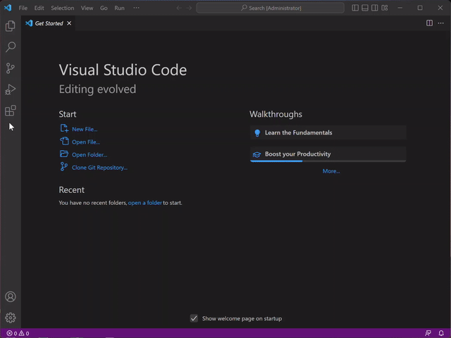

<p align="center">
  
  <h1 align="center">MicroBeaut Visual Basic for Applications (VBA) Snippets</h1>
</p>

### Install MicroBeaut VBA Snippets from the Marketplace



# Provides VBA Snippets for:

## VBA Constants
- [Calendar constants](#calendar-constants)
- [Color constants](#color-constants)
- [Comparison constants](#comparison-constants)
- [Date constants](#date-constants)
  - [Day of Week](#day-of-week)
  - [First Week Of Year](#first-week-of-year)
- [Dir, GetAttr, and SetAttr constants](#dir-getattr-and-setattr-constants)

## Statements
- [AppActivate](#appactivate)
- [Beep](#beep)
- [Call](#call)
- [ChDir](#chdir)
- [ChDrive](#chdrive)
- [Close](#close)
- [Const](#const)
- [Date](#date)
- [DeleteSetting](#deletesetting)
- [Dim](#dim)
- [Do...Loop](#doloop)
- [End](#end)
- [Enum](#enum)
- [Erase](#erase)
- [Error](#error)
- [Event](#event)
- [Exit](#exit)
- [FileCopy](#filecopy)
- [For Each...Next](#for-eachnext)
- [For...Next](#fornext)
- [Function](#function)
- [Get](#get)
- [GoSub...Return](#gosubreturn)
- [GoTo](#goto)
- [If...Then...Else](#ifthenelse)
- [Input #](#input)
- [Kill](#kill)
- [Let](#let)
- [Line Input #](#line-input)
- [Load](#load)
- [Lock, Unlock](#lock-unlock)
- [LSet](#lset)
- [Mid](#mid)
- [MkDir](#mkdir)
- [Name](#name)
- [On Error](#on-error)
- [On...GoSub, On...GoTo](#ongosub-ongoto)
- [Open](#open)
- [Option Base](#option-base)
- [Option Compare](#option-compare)
- [Option Explicit](#option-explicit)
- [Option Private](#option-private)
- [Print #](#print)
- [Private](#private)
- [Property Get](#property-get)
- [Property Let](#property-let)
- [Property Set](#property-set)
- [Public](#public)
- [Put](#put)
- [RaiseEvent](#raiseevent)
- [Randomize](#randomize)
- [ReDim](#redim)
- [Rem](#rem)
- [Reset](#reset)
- [Resume](#resume)
- [RmDir](#rmdir)
- [RSet](#rset)
- [SaveSetting](#savesetting)
- [Seek](#seek)
- [Select Case](#select-case)
- [SendKeys](#sendkeys)
- [Set](#set)
- [SetAttr](#setattr)
- [Static](#static)
- [Stop](#stop)
- [Sub](#sub)
- [Time](#time)
- [Type](#type)
- [Unload](#unload)
- [While...Wend](#whilewend)
- [Width #](#width)
- [With](#with)
- [Write #](#write)


## Functions

### Conversion functions
  - [Asc](#asc)
  - [Chr](#chr)
  - [Format](#format)
  - [Hex](#hex)
  - [Oct](#oct)
  - [Str](#str)
  - [Val](#val)

### Math functions
  - [Abs](#abs)
  - [Atn](#atn)
  - [Cos](#cos)
  - [Exp](#exp)
  - [Int, Fix](#int-fix)
  - [Log](#log)
  - [Rnd](#rnd)
  - [Sgn](#sgn)
  - [Sin](#sin)
  - [Sqr](#sqr)
  - [Tan](#tan)


# [VB Constants](#vba-constants)
The following ``constants`` can be used anywhere in your code in place of the actual values.

## Calendar constants

### **Prefix**

```vb
VbCalendar 
```

The ```VbCalendar``` argument has the following values.

|Constant|Value|Description|
|:-----|:-----|:-----|
|**vbCalGreg**|0|Indicates that the Gregorian calendar is used.|
|**vbCalHijri**|1|Indicates that the Hijri calendar is used.|


## Color constants

### **Prefix**

```vb
ColorConstants 
```

The ```ColorConstants``` argument has the following values.

|Constant|Value|Description|
|:-----|:-----|:-----|
|**vbBlack**|0x0|Black|
|**vbRed**|0xFF|Red|
|**vbGreen**|0xFF00|Green|
|**vbYellow**|0xFFFF|Yellow|
|**vbBlue**|0xFF0000|Blue|
|**vbMagenta**|0xFF00FF|Magenta|
|**vbCyan**|0xFFFF00|Cyan|
|**vbWhite**|0xFFFFFF|White|


## Comparison constants

### **Prefix**

```vb
VbCompareMethod 
```

The ```VbCompareMethod``` argument has the following values.

|Constant|Value|Description|
|:-----|:-----|:-----|
|**vbUseCompareOption**|-1|Performs a comparison by using the setting of the **[Option Compare](option-compare-statement.md)** statement.|
|**vbBinaryCompare**|0|Performs a binary comparison.|
|**vbTextCompare**|1|Performs a textual comparison.|
|**vbDatabaseCompare**|2|For Microsoft Access (Windows only), performs a comparison based on information contained in your database.|


## Date constants

The following ``constants`` can be used anywhere in your code in place of the actual values.

###  Day of Week

#### **Prefix**

```vb
VbDayOfWeek 
```

The ```VbDayOfWeek``` argument has the following values.

|Constant|Value|Description|
|:-----|:-----|:-----|
|**VbUseSystemDayOfWeek**|0|Use the day of the week specified in your system settings for the first day of the week.|
|**vbSunday**|1|Sunday (default)|
|**vbMonday**|2|Monday|
|**vbTuesday**|3|Tuesday|
|**vbWednesday**|4|Wednesday|
|**vbThursday**|5|Thursday|
|**vbFriday**|6|Friday|
|**vbSaturday**|7|Saturday|


### First Week Of Year

#### **Prefix**

```vb
VbFirstWeekOfYear 
```

The  ```VbFirstWeekOfYear``` argument has the following values.

|Constant|Value|Description|
|:-----|:-----|:-----|
|**vbUseSystem**|0|Use NLS API setting.|
|**VbFirstJan1**|1|Start with week in which January 1 occurs (default).|
|**vbFirstFourDays**|2|Start with the first week that has at least four days in the new year.|
|**vbFirstFullWeek**|3|Start with the first full week of the year.|


## Dir, GetAttr, and SetAttr constants

### **Prefix**

```vb
VbFileAttribute 
```

The  ```VbFileAttribute``` argument has the following values.

|Constant|Value|Description|
|:-----|:-----|:-----|
|**vbNormal**|0|Normal (default for **Dir** and **SetAttr**)|
|**vbReadOnly**|1|Read-only|
|**vbHidden**|2|Hidden|
|**vbSystem**|4|System file|
|**vbVolume**|8|Volume label|
|**vbDirectory**|16|Directory or folder|
|**vbArchive**|32|File has changed since last backup|
|**vbAlias**|64|On the Macintosh, identifier is an alias|

Only **VbNormal**, **vbReadOnly**, **vbHidden**, and **vbAlias** are available on the Macintosh.


# [Statements](#statements)
## **``AppActivate``**
Activates an application window.

### **Prefix**
```vb
AppActivate 
```
### **Syntax**
```vb
AppActivate title, [ wait ]
```


## **``Beep``**
Sounds a tone through the computer's speaker.

### **Prefix**
```vb
Beep 
```

### **Syntax**
```vb
Beep
```


## **``Call``**
Transfers control to a Sub procedure, Function procedure, or dynamic-link library (DLL) procedure.

### **Prefix**
```vb
Call 
```

### **Syntax**
```vb
[ Call ] name [ argumentlist ]
```


## **``ChDir``**
Changes the current directory or folder.


### **Prefix**
```vb
ChDir
```

### **Syntax**
```vb
ChDir path
```


## **``ChDrive``**
Changes the current drive.

### **Prefix**
```vb
ChDrive
```

### **Syntax**
```vb
ChDrive drive
```


## **``Close``**
Concludes input/output (I/O) to a file opened by using the Open statement.

### **Prefix**
```vb
Close 
```

### **Syntax**
```vb
Close [ filenumberlist ]
```


## **``Const``**
Declares `constants` for use in place of literal values.

### **Prefix**
```vb
Const
```

### **Syntax**
```vb
[ Public | Private ] Const constname [ As type ] = expression
```


## **``Date``**
Sets the current system date ``#mmmm d, yyyy#``.

### **Prefix**
```vb
Date
```

### **Syntax**
```vb
Date = date
```


## **``DeleteSetting``**
Deletes a section or key setting from an application's entry in the Windows ``registry`` or (on the Macintosh) information in the application's initialization file.

### **Prefix**
```vb
DeleteSetting 
```

### **Syntax**
```vb
DeleteSetting appname, section, key
```


## **``Dim``**
Declares ``variables`` and allocates storage space.

### **Prefix**
```vb
Dim 
Dim WithEvents
```

### **Syntax**
```vb
Dim [ WithEvents ] varname [ ( [ subscripts ] ) ] [ As [ New ] type ]
```


## **``Do...Loop``**
Repeats a block of ``statements`` while a condition is **True** or until a condition becomes **True**.

### **Prefix**
```vb
Do Until Loop
Do While Loop
```

### **Syntax**
```vb
Do [{ While | Until } condition ]
  [ statements ]
  [ Exit Do ]
  [ statements ]
Loop
```

Or,

### **Prefix**
```vb
Do Loop Until
Do Loop While
```

### **Syntax**
```vb
Do
  [ statements ]
  [ Exit Do ]
  [ statements ]
Loop [{ While | Until } condition ]
```


## **``End``**
Ends a procedure or block.

### **Prefix**
```vb
End
End Function
End If
End Property
End Select
End Sub
End Type
End With
```

### **Syntax**
```vb
End
End Function
End If
End Property
End Select
End Sub
End Type
End With
```


## **``Enum``**
Declares a type for an enumeration.

### **Prefix**
```vb
Enum
```

### **Syntax**
```vb
[ Public | Private ] Enum name
  membername [= constantexpression ]
  membername [= constantexpression ] . . .
End Enum
```


## **``Erase``**
Reinitializes the elements of fixed-size ``arrays`` and releases dynamic-array storage space.

### **Prefix**
```vb
Erase
```

### **Syntax**
```vb
Erase arraylist
```


## **``Error``**
Simulates the occurrence of an error.

### **Prefix**
```vb
Error 
```

### **Syntax**
```vb
Error errornumber
```


## **``Event``**
Declares a user-defined event.

### **Prefix**
```vb
Event 
```

### **Syntax**
```vb
[ Public ] Event procedurename [ (arglist) ]
```


## **``Exit``**
Exits a block of Do…Loop, For…Next, Function, Sub, or Property code.

### **Prefix**
```vb
Exit Do
Exit Fo
Exit Fu
Exit Pr
Exit Su
```

### **Syntax**
```vb
Exit Do
Exit For
Exit Function
Exit Property
Exit Sub
```


## **``FileCopy``**
Copies a file.

### **Prefix**
```vb
FileCopy
```

### **Syntax**
```vb
FileCopy source, destination
```


## **``For Each...Next``**
Repeats a group of ``statements`` for each element in an ``arrays`` or collection.

### **Prefix**
```vb
For Each
```

### **Syntax**
```vb
For Each element In group
  [ statements ]
  [ Exit For ]
  [ statements ]
Next [ element ]
```


## **``For...Next``**
Repeats a group of ``statements`` a specified number of times.

### **Prefix**
```vb
For Next
```

### **Syntax**
```vb
For counter = start To end [ Step step ]
  [ statements ]
  [ Exit For ]
  [ statements ]
Next [ counter ]
```


## **``Function``**
Declares the name, arguments, and code that form the body of a **Function** ``procedure``.

### **Prefix**
```vb
Function
Function Static
```

### **Syntax**
```vb
[Public | Private | Friend] [ Static ] Function name [ ( arglist ) ] [ As type ]
  [ statements ]
  [ name = expression ]
  [ Exit Function ]
  [ statements ]
  [ name = expression ]
End Function
```


## **``Get``**
Reads data from an open disk file into a variable.

### **Prefix**
```vb
Get 
```

### **Syntax**
```vb
Get [ # ] filenumber, [ recnumber ], varname 
```


## **``GoSub...Return``**
Branches to and returns from a subroutine within a procedure.

### **Prefix**
```vb
GoSub 
```

### **Syntax**
```vb
GoSub line
... line
line ...
Return
```


## **``GoTo``**
Branches unconditionally to a specified line within a procedure.

### **Prefix**
```vb
GoTo line
```

### **Syntax**
```vb
GoTo line
```


## **``If...Then...Else``**
Conditionally executes a group of ``statements``, depending on the value of an expression.

### **Prefix**
```vb
If 
```

### **Syntax**
```vb
If condition Then [ statements ] [ Else elsestatements ]

Or,

If condition Then
  [ statements ]
[ ElseIf condition-n Then
  [ elseifstatements ]]
[ Else
  [ elsestatements ]]
End If
```


## **``Load``**
Loads an object but doesn't show it.

### **Prefix**
```vb
Load
```

### **Syntax**
```vb
Load object
```


## **``Input``**
Reads data from an open sequential file and assigns the data to variables.

### **Prefix**
```vb
Input 
```

### **Syntax**
```vb
Input #filenumber, varlist
```


## **``Kill``**
Deletes files from a disk.

### **Prefix**
```vb
Kill 
```

### **Syntax**
```vb
Kill pathname
```


## **``Let``**
Assigns the value of an expression to a variable or property.

### **Prefix**
```vb
Let 
```

### **Syntax**
```vb
[ Let ] varname = expression
```


## **``Line Input``**
Reads a single line from an open sequential file and assigns it to a String variable.

### **Prefix**
```vb
Line Input
```

### **Syntax**
```vb
Line Input #
```


## **``Lock, Unlock``**
Controls access by other processes to all or part of a file opened by using the Open statement.

### **Prefix**
```vb
Lock 
Unlock 
```

### **Syntax**
```vb
Lock [ # ] filenumber, [ recordrange ]
Unlock [ # ] filenumber, [ recordrange ]
```


## **``LSet``**
Left aligns a string within a string variable, or copies a variable of one ``user-defined type`` to another variable of a different user-defined type.

### **Prefix**
```vb
LSet
```

### **Syntax**
```vb
LSet stringvar = string
LSet varname1 = varname2
```


## **``Mid``**
Replaces a specified number of characters in a **Variant (String)** variable with characters from another string.

### **Prefix**
```vb
Mid
```

### **Syntax**
```vb
Mid(stringvar, start, [ length ] ) = string
```


## **``MkDir``**
Creates a new directory or folder.

### **Prefix**
```vb
MkDir
```

### **Syntax**
```vb
MkDir path
```


## **``Name``**
Renames a disk file, directory, or folder.

### **Prefix**
```vb
Name 
```

### **Syntax**
```vb
Name oldpathname As newpathname
```


## **``On Error``**
Enables an error-handling routine and specifies the location of the routine within a procedure; can also be used to disable an error-handling routine.

### **Prefix**
```vb
On Error Go
On Error Re
```

### **Syntax**
```vb
On Error GoTo 0
On Error GoTo line
On Error Resume Next
```


## **``On...GoSub, On...GoTo``**
Branch to one of several specified lines, depending on the value of an expression.

### **Prefix**
```vb
On GoSub
On GoTo
```

### **Syntax**
```vb
On expression GoSub destinationlist
On expression GoTo destinationlist
```


## **``Open``**
Enables input/output (I/O) to a file.

### **Prefix**
```vb
Open 
```

### **Syntax**
```vb
Open pathname For mode [ Access access ] [ lock ] As [ # ] filenumber [ Len = reclength ]
```


## **``Option Base``**
Used at the module level to declare the default lower bound for array subscripts.

### **Prefix**
```vb
Option Ba
```

### **Syntax**
```vb
Option Base { 0 | 1 }
```


## **``Option Compare``**
Used at the module level to declare the default comparison method to use when string data is compared.

### **Prefix**
```vb
Option Co
```

### **Syntax**
```vb
Option Compare { Binary | Text | Database }
```


## **``Option Explicit``**
Used at the module level to force explicit declaration of all variables in that module.

### **Prefix**
```vb
Option Ex
```

### **Syntax**
```vb
Option Explicit
```


## **``Option Private``**
When used in host applications that allow references across multiple projects, **Option Private Module** prevents a module's contents from being referenced outside its project. In host applications that don't permit such references, for example, standalone versions of Visual Basic, **Option Private** has no effect.

### **Prefix**
```vb
Option Pr
```

### **Syntax**
```vb
Option Private Module
```


## **``Print``**
Writes display-formatted data to a sequential file.

### **Prefix**
```vb
Print #
```

### **Syntax**
```vb
Print #filenumber, [ outputlist ]
```


## **``Private``**
Used at the module level to declare private variables and allocate storage space.

### **Prefix**
```vb
Private
Private With
```

### **Syntax**
```vb
Private [ WithEvents ] varname [ ( [ subscripts ] ) ] [ As [ New ] type ]
```


## **``Property Get``**
Declares the name, arguments, and code that form the body of a **Property** procedure, which gets the value of a property.

### **Prefix**
```vb
Property Get
Property Get Static
```

### **Syntax**
```vb
[ Public | Private | Friend ] [ Static ] Property Get name [ (arglist) ] [ As type ]
  [ statements ]
  [ name = expression ]
[ Exit Property ]
  [ statements ]
  [ name = expression ]
End Property
```


## **``Property Let``**
Declares the name, arguments, and code that form the body of a **Property** procedure, which assigns a value to a property.

### **Prefix**
```vb
Property Let
Property Let Static
```

### **Syntax**
```vb
[ Public | Private | Friend ] [ Static ] Property Let name ( [ arglist ], value )
  [ statements ]
  [ Exit Property ]
  [ statements ]
End Property
```


## **``Property Set``**
Declares the name, arguments, and code that form the body of a **Property** procedure, which sets a reference to an object.

### **Prefix**
```vb
Property Set
Property Set Static
```

### **Syntax**
```vb
[ Public | Private | Friend ] [ Static ] Property Set name ( [ arglist ], reference )
  [ statements ]
  [ Exit Property ]
  [ statements ]
End Property
```


## **``Public``**
Used at the module level to declare public variables and allocate storage space.

### **Prefix**
```vb
Public
Public With
```

### **Syntax**
```vb
Public [ WithEvents ] varname [ ( [ subscripts ] ) ] [ As [ New ] type ]
```


## **``Put``**
Writes data from a variable to a disk file.

### **Prefix**
```vb
Put 
```

### **Syntax**
```vb
Put [ # ] filenumber, [ recnumber ], varname
```


## **``RaiseEvent``**
Fires an event declared at the module level within a class, form, or document.

### **Prefix**
```vb
RaiseEvent 
```

### **Syntax**
```vb
RaiseEvent eventname [ ( argumentlist ) ]
```


## **``Randomize``**
Initializes the random-number generator.

### **Prefix**
```vb
Randomize 
```

### **Syntax**
```vb
Randomize [ number ]
```


## **``ReDim``**
Used at the procedure level to reallocate storage space for dynamic array variables.

### **Prefix**
```vb
ReDim 
```

### **Syntax**
```vb
ReDim [ Preserve ] varname ( subscripts )
```


## **``Rem``**
Used to include explanatory remarks in a program.

### **Prefix**
```vb
Rem  
```

### **Syntax**
```vb
Rem comment
```


## **``Reset``**
Closes all disk files opened by using the Open statement.

### **Prefix**
```vb
Reset  
```

### **Syntax**
```vb
Reset
```


## **``Resume``**
Removes an existing directory or folder.

### **Prefix**
```vb
Resume 
Resume Ne
Resume Li
```

### **Syntax**
```vb
Resume [ 0 ]
Resume Next
Resume line
```


## **``RmDir``**
Removes an existing directory or folder.

### **Prefix**
```vb
RmDir
```

### **Syntax**
```vb
RmDir path
```


## **``RSet``**
Right aligns a string within a string variable, or copies a variable of one user-defined type to another variable of a different user-defined type.

### **Prefix**
```vb
RSet
```

### **Syntax**
```vb
RSet stringvar = string
RSet varname1 = varname2
```


## **``SaveSetting``**
Saves or creates an application entry in the application's entry in the Windows registry or (on the Macintosh) information in the application's initialization file.

### **Prefix**
```vb
SaveSetting
```

### **Syntax**
```vb
SaveSetting appname, section, key, setting
```

### **Remarks**
The root of these registry settings is: <code>Computer\HKEY_CURRENT_USER\Software\VB and VBA Program Settings</code>.
<br/>


## **``Seek``**
Sets the position for the next read/write operation within a file opened by using the Open statement.

### **Prefix**
```vb
Seek 
```

### **Syntax**
```vb
Seek [ # ] filenumber, position
```


## **``Select Case``**
Executes one of several groups of statements, depending on the value of an expression.

### **Prefix**
```vb
Select Case
```

### **Syntax**
```vb
Select Case testexpression
[ Case expressionlist-n
  [ statements-n ]]
[ Case Else 
  [ elsestatements ]]
End Select
```


## **``SendKeys``**
Sends one or more keystrokes to the active window as if typed at the keyboard.

### **Prefix**
```vb
SendKeys
```

### **Syntax**
```vb
SendKeys [ # ] filenumber, position
```


## **``Set``**
Assigns an object reference to a variable or property.

### **Prefix**
```vb
Set 
```

### **Syntax**
```vb
Set objectvar = {[ New ] objectexpression | Nothing }
```


## **``SetAttr``**
Sets attribute information for a file.

### **Prefix**
```vb
SetAttr 
```

### **Syntax**
```vb
SetAttr pathname, attributes
```


## **``Static``**
Used at the procedure level to declare variables and allocate storage space. Variables declared with the **Static** statement retain their values as long as the code is running.

### **Prefix**
```vb
Static
```

### **Syntax**
```vb
Static varname [ ( [ subscripts ] ) ] [ As [ New ] type ]
```


## **``Stop``**
Suspends execution.

### **Prefix**
```vb
Stop
```

### **Syntax**
```vb
Stop
```


## **``Sub``**
Declares the name, arguments, and code that form the body of a **Sub** procedure.

### **Prefix**
```vb
Sub
Sub Static
```

### **Syntax**
```vb
[ Private | Public | Friend ] [ Static ] Sub name [ ( arglist ) ]
  [ statements ]
  [ Exit Sub ]
  [ statements ]
End Sub
```


## **``Time``**
Sets the system time. ``#hh:mm:ss AM/PM#``

### **Prefix**
```vb
Time 
```

### **Syntax**
```vb
Time = time
```


## **``Type``**
Used at the module level to define a user-defined data type containing one or more elements.

### **Prefix**
```vb
Type 
```

### **Syntax**
```vb
[ Private | Public ] Type varname
  elementname [ ( [ subscripts ] ) ] As type
  [ elementname [ ( [ subscripts ] ) ] As type ] . . .
End Type
```


## **``Unload``**
Removes an object from memory.

### **Prefix**
```vb
Unload 
```

### **Syntax**
```vb
Unload object
```


## **``While...Wend``**
Removes an object from memory.

### **Prefix**
```vb
While Wend
```

### **Syntax**
```vb
While condition
  [ statements ]
Wend
```


## **``Width``**
Assigns an output line width to a file opened by using the Open statement.

### **Prefix**
```vb
Width 
```

### **Syntax**
```vb
Width #filenumber, width
```


## **``With``**
Executes a series of statements on a single object or a user-defined type.

### **Prefix**
```vb
With
```

### **Syntax**
```vb
With object
  [ statements ]
End With
```


## **``Write``**
Writes data to a sequential file.

### **Prefix**
```vb
Write
```

### **Syntax**
```vb
Write #filenumber, [ outputlist ]
```

# [Conversion functions](#conversion-functions)
## **``Asc``**
Returns an Integer representing the character code corresponding to the first letter in a string.

### **Prefix**
```vb
Asc
```

### **Syntax**
```vb
Asc(string)
```


## **``Chr``**
Returns a String containing the character associated with the specified character code.

### **Prefix**
```vb
Chr
```

### **Syntax**
```vb
Chr(charcode)
```


## **``Format``**
Returns a Variant (String) containing an expression formatted according to instructions contained in a format expression.

### **Prefix**
```vb
Format
```

### **Syntax**
```vb
Format(Expression, [ Format ], [ FirstDayOfWeek ], [ FirstWeekOfYear ])
```


## **``Hex``**
Returns a Variant (String) containing an expression formatted according to instructions contained in a format expression.

### **Prefix**
```vb
Hex
```

### **Syntax**
```vb
Hex(number)
```


## **``Oct``**
Returns a Variant (String) representing the octal value of a number.

### **Prefix**
```vb
Oct
```

### **Syntax**
```vb
Oct(number)
```


## **``Str``**
Returns a Variant (String) representation of a number.

### **Prefix**
```vb
Str
```

### **Syntax**
```vb
Str(number)
```


## **``Val``**
Returns the numbers contained in a string as a numeric value of appropriate type.

### **Prefix**
```vb
Val
```

### **Syntax**
```vb
Val(string)
```

# [Math functions](#math-functions)
## **``Abs``**
Returns a value of the same type that is passed to it specifying the absolute value of a number.

### **Prefix**
```vb
Abs
```

### **Syntax**
```vb
Abs(number)
```


## **``Atn``**
Returns a Double specifying the arctangent of a number.

### **Prefix**
```vb
Atn
```

### **Syntax**
```vb
Atn(number)
```


## **``Cos``**
Returns a Double specifying the cosine of an angle.

### **Prefix**
```vb
Cos
```

### **Syntax**
```vb
Cos(number)
```


## **``Exp``**
Returns a Double specifying e (the base of natural logarithms) raised to a power.

### **Prefix**
```vb
Exp
```

### **Syntax**
```vb
Exp(number)
```


## **``Int, Fix``**
Returns a Double specifying e (the base of natural logarithms) raised to a power.

### **Prefix**
```vb
Int
Fix
```

### **Syntax**
```vb
Int(number)
Fix(number)
```


## **``Log``**
Returns a Double specifying the natural logarithm of a number.

### **Prefix**
```vb
Log
```

### **Syntax**
```vb
Log(number)
```


## **``Rnd``**
Returns a Single containing a pseudo-random number.

### **Prefix**
```vb
Rnd
```

### **Syntax**
```vb
Rnd [ (Number) ]
```


## **``Sgn``**
Returns a Variant (Integer) indicating the sign of a number.

### **Prefix**
```vb
Sgn
```

### **Syntax**
```vb
Sgn(number)
```


## **``Sin``**
Returns a Double specifying the cosine of an angle.

### **Prefix**
```vb
Sin
```

### **Syntax**
```vb
Sin(number)
```


## **``Sqr``**
Returns a Double specifying the sine of an angle.

### **Prefix**
```vb
Sqr
```

### **Syntax**
```vb
Sqr(number)
```


## **``Tan``**
Returns a Double specifying the tangent of an angle.

### **Prefix**
```vb
Tan 
```

### **Syntax**
```vb
Tan (number)
```

# Reference

### [Language reference for Visual Basic for Applications (VBA)](https://learn.microsoft.com/en-us/office/vba/api/overview/language-reference)
<br/>


# Release Notes

### [0.0.1]
- Initial release of MicroBeaut VBA Snippets

### [0.0.2]
- Changed package description
- Revised statements
- Added new statements

### [0.0.3]
- Changed the prefix for,
    - ```Dim WithEvent```
    - ``` On Error *```
    - ```Private WithEvent```
    - ```Public WithEvent```

### [0.0.4]
- Removed statements ``If...Then..Exit`` inside,
    - ``Do...Loop``
    - ``For Each...Next``
    - ``For...Next``
    - ``Function``
    - ``If...Then...Else``
- Updated descriptions
- Added new statements
- Added Conversion functions
- Added Math functions

### [0.0.5]
- Fixed package not updated

### [0.0.6]
- Added VBA Constants
<br/>

# License

MIT License

Copyright &copy; 2023 MicroBeaut